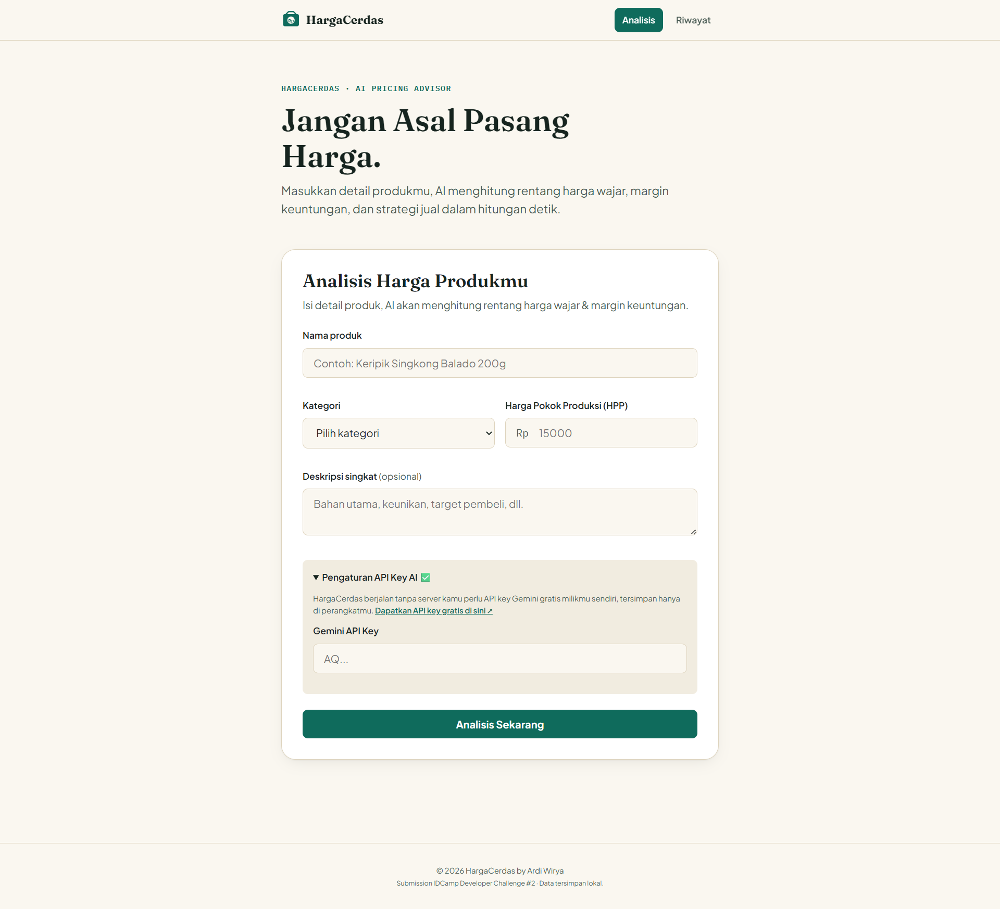

<div align="center">

# HargaCerdas

**Jangan Asal Pasang Harga.**

AI Pricing & Margin Advisor untuk pelaku UMKM Indonesia, dibangun untuk **IDCamp Developer Challenge #2: Digitalization & Acceleration of MSMEs with Generative AI**.

[Live Demo](https://hargacerdas.vercel.app/) · [Laporkan Bug](../../issues) · [Project Brief](https://docs.google.com/document/d/1pRFVWhHqAukP9U_6fq0nyR4-QhxuRadM91pj_DPlaKo/edit?tab=t.0)

</div>

Preview: 



## Latar Belakang

64 juta pelaku UMKM menyumbang 60% PDB Indonesia, tapi sebagian besar masih menentukan harga jual secara asal ikut-ikutan kompetitor atau sekadar tebak-tebak, tanpa mempertimbangkan margin keuntungan yang sehat. Akibatnya: profit tipis, atau kalah bersaing tanpa tahu sebabnya.

**HargaCerdas** menyelesaikan masalah ini dengan AI generatif: masukkan nama produk, kategori, dan harga pokok produksi (HPP), AI akan menghasilkan rentang harga pasar yang wajar, rekomendasi harga jual, breakdown margin di beberapa skenario, serta strategi positioning dalam hitungan detik, dan sepenuhnya gratis.

## Fitur

- **Analisis harga berbasis AI** — Generative AI (Gemini) menganalisis kategori, HPP, dan deskripsi produk untuk merekomendasikan harga jual dengan justifikasi berbahasa natural.
- **Breakdown margin otomatis** — 3 skenario harga (Ekonomis / Kompetitif / Premium) dihitung otomatis dari HPP.
- **Riwayat analisis** — tersimpan lokal di perangkat (IndexedDB), bisa dibuka & dihapus kapan saja.
- **Tanpa server, tanpa biaya tersembunyi** — HargaCerdas adalah static site murni; kamu memakai API key Gemini gratis milikmu sendiri, tersimpan hanya di browser kamu.
- **PWA** — bisa di-install ke home screen, shell tetap tampil saat offline.
- **Aksesibel** — navigasi keyboard penuh, focus ring terlihat, label ARIA, kontras warna sesuai WCAG AA.
- **Mobile-first & ringan** — bundle JS ~7 KB gzip, tanpa framework berat.

## 🛠️ Tech Stack

| Layer | Teknologi | Alasan |
|---|---|---|
| Build tool | [Vite](https://vitejs.dev) | Dev server cepat, output production kecil, native ES Modules |
| UI | HTML + CSS murni + Vanilla JS (ES Modules) | Tidak overkill untuk scope MVP, performa maksimal, mudah diaudit |
| AI | [Google Gemini API](https://ai.google.dev) (`gemini-3.5-flash', 'gemini-3.1-flash-lite`) | Free tier memadai untuk demo, mendukung structured JSON output |
| Storage | IndexedDB (native) | Riwayat analisis persisten di perangkat, tanpa backend |
| PWA | `vite-plugin-pwa` | Installable, offline shell |
| Deployment | Vercel | Static hosting gratis, auto-deploy dari GitHub |

## 📂 Struktur Proyek

```
hargacerdas/
├── docs/                 # project brief, screenshots app
├── public/                 # favicon, ikon PWA, robots.txt
├── src/
│   ├── components/         # UI components (form, result card, toast, dll.)
│   ├── services/           # aiService (Gemini) & dbService (IndexedDB)
│   ├── utils/               # pure functions: margin-calc, validators, formatters
│   ├── router/              # hash-based router ringan
│   ├── styles/               # design tokens + base + layout + components
│   ├── pages/                # Home, History, ResultDetail
│   ├── app.js                # app shell & route registration
│   └── main.js                # entry point
├── index.html
├── vite.config.js
└── package.json
```

## Menjalankan Secara Lokal

```bash
git clone https://github.com/ardiwirya/hargacerdas.git
cd hargacerdas
npm install
npm run dev
```

Buka `http://localhost:5173`. Kamu memerlukan **API key Gemini gratis** — dapatkan di [aistudio.google.com/apikey](https://aistudio.google.com/apikey), lalu masukkan di panel "Pengaturan API Key AI" pada form (tersimpan hanya di localStorage browser kamu).

```bash
npm run build     # build production ke folder dist/
npm run preview   # preview hasil build
```

## 🧪 Testing Checklist

- [ ] Form menolak submit jika nama produk < 3 karakter
- [ ] Form menolak submit jika HPP ≤ 0
- [ ] Form menolak submit jika API key kosong/tidak valid
- [ ] Analisis berhasil menampilkan struk hasil dengan data yang sesuai skema
- [ ] Simpan ke riwayat → data muncul di halaman Riwayat
- [ ] Hapus riwayat → item hilang dari daftar & IndexedDB
- [ ] Navigasi keyboard: Tab dapat mencapai semua elemen interaktif, focus ring terlihat
- [ ] Responsive: form & struk tetap terbaca di layar 360px
- [ ] PWA: `manifest.webmanifest` & service worker ter-generate saat build

## 📜 Lisensi

[MIT License](LICENSE) © 2026 Ardi Wirya Indarto

---

<div align="center">
&copy; 2026 HargaCerdas by Ardi Wirya Indarto
</div>
